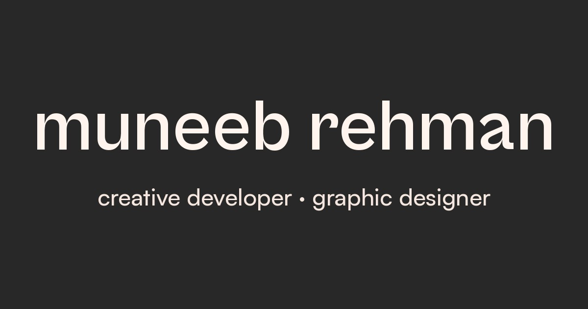

<div align="center">

# MUNEEB REHMAN

**Creative Developer · Web Designer · Graphic Designer · AI Enthusiast · Photo Editor**

[](https://muneeb-port-folio.netlify.app/)
[](https://vite.dev/)
[](https://threejs.org/)
[](https://gsap.com/)
[](LICENSE)

</div>



## About

This is my personal portfolio, designed and built from scratch to feel more like an interactive experience than a normal web page. It opens with a WebGL hero scene (Three.js with custom GLSL shaders and a 3D logo), physics-based motion (Matter.js), buttery smooth scrolling (Lenis) and scroll-driven animation throughout (GSAP ScrollTrigger).

If you are into creative development, feel free to explore the code, fork it, and build your own version.

## Live demo

**[muneeb-port-folio.netlify.app](https://muneeb-port-folio.netlify.app/)**

## Features

- WebGL hero with a real-time 3D logo (GLB model) and custom shader effects (GLSL)
- Distortion shader scene on the contact page
- Physics-driven interactions powered by Matter.js
- Smooth scrolling with Lenis, animated with GSAP and ScrollTrigger
- Multi-page Vite build: Home, Contact and a custom 404 page
- Separate optimised textures for desktop and mobile, so phones do not download desktop-size images
- Project list where hovering a letter shows a live preview of each site
- Custom fonts (Satoshi and Cabinet Grotesk, variable fonts)
- SEO and social sharing ready (Open Graph image included)
- Fully responsive, mobile-first texture switching

## Built with

| Tool | What it does here |
| --- | --- |
| [Vite 8](https://vite.dev/) | Dev server and multi-page production build |
| [Three.js](https://threejs.org/) | WebGL scenes and the 3D hero logo |
| [GSAP](https://gsap.com/) + ScrollTrigger | Scroll animations and page motion |
| [Lenis](https://lenis.darkroom.engineering/) | Smooth scrolling |
| [Matter.js](https://brm.io/matter-js/) | 2D physics interactions |
| [vite-plugin-glsl](https://github.com/UstymUkhman/vite-plugin-glsl) | Importing GLSL shaders as modules |

## Pages

- `/` Home: hero, about, selected projects, toolkit, trajectory, footer
- `/contact/` Contact page with its own WebGL distortion scene
- `404.html` Custom not-found page

## Run it locally

You need Node.js 20 or newer.

```bash
git clone https://github.com/muneebrahmancmd/muneeb-rehman-portfolio.git
cd muneeb-rehman-portfolio
npm install
npm run dev
```

## Build for production

```bash
npm run build
npm run preview
```

The production files are generated in `dist/`.

## Deployment

- **Netlify (main site):** [muneeb-port-folio.netlify.app](https://muneeb-port-folio.netlify.app/), deployed from the `dist/` build.
- **GitHub Pages:** the included GitHub Actions workflow builds the site on every push to `main` and deploys it to GitHub Pages automatically. The workflow builds with `--base=/muneeb-rehman-portfolio/` so asset paths stay correct under the repository sub-path, while Netlify keeps using the root path.

## Workflow

This repo ships with two GitHub Actions workflows in `.github/workflows/`:

- `deploy.yml` builds the site and deploys it to GitHub Pages on every push to `main` (can also be run manually from the Actions tab).
- `ci.yml` runs on pull requests: installs dependencies and builds the project to make sure nothing is broken before merging.

## Make it yours

Fork it and swap in your own content:

- Main text and page content: `index.html` and `src/shared/i18n/locales/en.js`
- Projects: the `projects__link` items in `index.html`
- Hero name and role images: `public/home/hero/textures/`
- 3D logo: replace `public/home/hero/logo.glb` with your own model
- Contact page images: `public/contact/textures/`
- Colors, fonts and shared styles: `src/assets/` and `src/shared/`

## Support

If this project helped you or you just like how it looks, **give it a star**. It costs nothing and it genuinely helps the project reach more people.

Found a bug or have an idea? Open an issue, or send a pull request.

## Contact

- Email: muneebrahman500@gmail.com
- GitHub: [muneebrahmancmd](https://github.com/muneebrahmancmd)
- LinkedIn: [muneeb-soomro-887925333](https://www.linkedin.com/in/muneeb-soomro-887925333/)
- Instagram: [he__muneeb](https://www.instagram.com/he__muneeb/)
- Twitter / X: [Muneeb455365487](https://twitter.com/Muneeb455365487)

## License

Released under the [MIT License](LICENSE). Use the code, learn from it, build your own version. A link back is appreciated.
